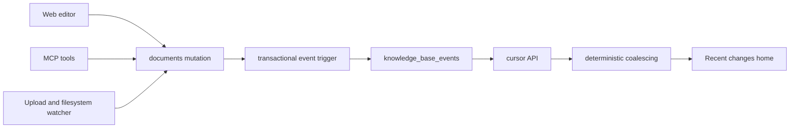

# Recent Changes Home - V1 Spec

Author: Lucas + Codex · Date: 2026-07-16 · Status: Implemented

## Goal

Make the root of every wiki answer one question immediately: **what changed recently?**

Opening `/wikis/{slug}` with no page parameter shows a deterministic, newest-first activity timeline. It includes page creation and edits, source additions, renames, moves, and removals. Every item that still exists links to the relevant page or source.

This replaces the manually maintained `log.md` concept as the source of truth for activity.

## Product behavior

- A wiki root with no `?p=` opens **Recent changes**.
- A direct page URL such as `/wikis/{slug}?p=12` continues to open that page.
- **Recent** is the first item in the wiki sidebar and is active when no page is selected.
- Clicking Recent creates a browser-history entry and removes `?p=`. Back returns to the prior page.
- Course roots keep their current overview/resume behavior. Recent is a wiki-mode home, not a replacement for course progress.
- Public wiki surfaces do not expose this feed in V1. Source filenames and private work patterns must not leak through public sharing.

## Non-goals

- No line-by-line or Git-style diff.
- No document restoration or version browsing.
- No highlight, comment, reply, quiz-progress, OCR-status, or indexing events.
- No public activity feed.
- No activity filters, search, or date picker in V1.
- No attempt to reconstruct historical edits from `documents.updated_at`.

An event states that a mutation occurred. Exact content history requires a future `document_revisions` design and must not be stored in the events table.

## Architecture



`knowledge_base_events` is append-only. Document writes and their events commit or roll back together. The activity feed never depends on a client remembering to send a second logging request.

Postgres and SQLite use the same event semantics. PostgreSQL implements them with row triggers in a Supabase migration. SQLite defines equivalent triggers in `shared/sqlite_schema.sql`, so web writes, local uploads, and filesystem-watcher writes all pass through the same capture layer.

## Data model

Table: `knowledge_base_events`

| Column | Postgres type | Purpose |
|---|---|---|
| `id` | `BIGINT GENERATED ALWAYS AS IDENTITY` | Canonical total order and pagination cursor. Serialized to the web as a string. SQLite uses `INTEGER PRIMARY KEY AUTOINCREMENT`. |
| `knowledge_base_id` | `UUID NOT NULL` | Owning wiki. Cascades when the wiki is deleted. |
| `user_id` | `UUID NOT NULL` | Owning user for RLS and isolation. |
| `event_type` | `TEXT NOT NULL` | Stable semantic event name from the taxonomy below. |
| `subject_kind` | `TEXT NOT NULL` | `wiki`, `wiki_page`, or `source`. |
| `document_id` | `UUID NULL` | Current subject identifier when available. Deliberately has no document foreign key, so deletion events survive hard deletion. |
| `document_number` | `INTEGER NULL` | Link snapshot for `?p=` or `?doc=` routes. |
| `document_version` | `INTEGER NULL` | Version at the mutation, when applicable. |
| `subject_title` | `TEXT NOT NULL` | Historical title snapshot. |
| `subject_path` | `TEXT NULL` | Historical full-path snapshot. |
| `event_key` | `TEXT NULL UNIQUE` | Idempotency key for backfill and generated create events. Ordinary mutations leave it null. |
| `metadata` | `JSONB NOT NULL DEFAULT '{}'` | Small structured facts such as changed fields, file type, and file size. Never document content. |
| `occurred_at` | `TIMESTAMPTZ NOT NULL DEFAULT now()` | Server-authored UTC time. |

Required indexes:

```sql
CREATE INDEX idx_kb_events_feed
  ON knowledge_base_events (knowledge_base_id, id DESC);

CREATE INDEX idx_kb_events_user
  ON knowledge_base_events (user_id, id DESC);
```

RLS permits `SELECT` only when `user_id = auth.uid()`. Clients receive no insert, update, or delete policy. A security-definer trigger function owns writes.

Events are immutable in normal operation. There is no update endpoint and no delete endpoint. Deleting a knowledge base cascades its entire activity history.

## Event taxonomy

| Event | Meaning | Default feed copy |
|---|---|---|
| `tracking.started` | Activity tracking was enabled for an existing wiki. | Activity tracking started |
| `wiki.created` | A new wiki was created. | Created this wiki |
| `page.created` | A visible wiki page was created. | Created {page} |
| `page.updated` | User-visible page content or metadata changed. | Edited, renamed, moved, or updated {page}, based on `metadata.changes` |
| `page.archived` | A hosted wiki page was archived. | Archived {page} |
| `page.restored` | An archived page became active again. | Restored {page} |
| `page.deleted` | A page was hard-deleted, primarily in local mode. | Deleted {page} |
| `source.added` | A visible source or note entered the wiki. | Added {source} |
| `source.updated` | A source was deliberately replaced, renamed, moved, or edited. | Updated {source} |
| `source.deleted` | A source was removed. | Removed {source} |

The taxonomy describes durable facts rather than every UI verb. For `page.updated` and `source.updated`, `metadata.changes` controls the display phrase:

- `['title']`: Renamed
- `['path']`: Moved
- `['content']`, `['tags']`, `['date']`, or `['properties']`: Edited
- Any mixed set: Updated

Actor attribution (who made the change) and richer `source.added` copy (Uploaded vs Clipped) are deferred: triggers cannot know the actor without session-context plumbing, so V1 stores no attribution columns. Being append-only, the table can gain nullable attribution columns later without rewriting history.

## Capture rules

### Knowledge-base creation

- Insert one `wiki.created` event with the knowledge-base creation timestamp.
- Starter documents are part of this operation and do not generate separate feed rows.
- New wikis stop scaffolding `log.md`.
- New overview templates remove the static `Recent Updates` section.

### Document insertion

- A visible document under `/wiki/` generates `page.created`.
- A visible document elsewhere generates `source.added`.
- `index.json`, `log.md`, hidden web-clip assets, and any document with `metadata.hidden = true` or `metadata.asset = true` generate no event.
- A generated starter `overview.md` is suppressed at creation, but later edits to Overview are recorded.

### Document update

One SQL row update creates at most one raw event. The trigger records all relevant changed fields in `metadata.changes`.

User-visible changes are:

- `content`
- `title` or `filename`
- `path`
- `tags`
- `date`
- `metadata.properties`
- `archived` state

The trigger ignores:

- `updated_at` by itself
- `version` by itself
- `status`, `parser`, `page_count`, indexing hashes, and processing errors
- highlights and replies
- course progress in `metadata.course`
- hidden asset metadata

Initial extraction is not an edit. A source transitioning from pending or processing with null content to ready with extracted content does not generate `source.updated`; its original `source.added` event already represents the upload.

Setting `archived` takes priority over other field comparisons and emits `page.archived` or `source.deleted`. Restoring emits `page.restored`.

### Document deletion

- A visible wiki page generates `page.deleted`.
- A visible source generates `source.deleted`.
- The event stores title, path, document number, and version snapshots before deletion.
- `document_id` is nullable and has no foreign key to `documents`, so hard deletion cannot erase or invalidate history.
- No document content or excerpt is retained.

### Transaction and retry behavior

- Event insertion occurs in the same database transaction as the mutation.
- A rolled-back mutation leaves no event.
- Repeating an identical content update creates no event because the trigger compares old and new values.
- Creation and backfill use stable `event_key` values, such as `kb:{id}:created` and `doc:{id}:created`, to make retries idempotent.
- Ordinary updates have no `event_key`; each committed content mutation is intentionally preserved.

## Autosaves and deterministic coalescing

The editor saves after 1.5 seconds of inactivity. Every committed save remains a raw event, but the feed combines noisy consecutive changes into one display item.

Coalescing is a pure function applied to all raw events currently loaded in the client:

1. Sort by `id DESC`; `occurred_at` is display data, not the tie-breaker.
2. Only `page.updated` and `source.updated` events may coalesce.
3. Events must have the same `document_id` and `subject_kind`.
4. Events must be consecutive in the raw stream.
5. The gap between adjacent events must be at most 10 minutes.
6. Events must fall on the same browser-local calendar day.
7. Creates, additions, archives, restores, and deletions never coalesce.

The newest event supplies the displayed title, path, version, and link. The group unions `metadata.changes`, retains the newest and oldest timestamps, and reports `event_count`.

Examples:

- Four content autosaves become `Edited Retrieval design · 4 edits`.
- A content save followed by a title save becomes `Updated Retrieval design · 2 changes`.
- Edits separated by more than 10 minutes remain separate entries.
- Loading the next API page re-runs coalescing across the entire accumulated list, so groups can merge cleanly across pagination boundaries.

Raw events remain available for future audit or revision work; coalescing loses no stored information.

## API

Endpoint:

```text
GET /v1/knowledge-bases/{kb_id}/events?limit=50&before={event_id}
```

Rules:

- `limit` defaults to 50 and is capped at 100.
- `before` is an exclusive raw event ID cursor.
- The query orders by `id DESC` and uses `id < before` for the next page.
- The API verifies that the authenticated user owns the knowledge base.
- IDs and cursors are JSON strings to avoid JavaScript `BIGINT` precision loss.
- The endpoint returns raw events. The web performs deterministic coalescing.

Response:

```json
{
  "items": [
    {
      "id": "1842",
      "event_type": "page.updated",
      "subject_kind": "wiki_page",
      "document_id": "...",
      "document_number": 17,
      "document_version": 8,
      "subject_title": "Retrieval design",
      "subject_path": "/wiki/retrieval-design.md",
      "metadata": { "changes": ["content"] },
      "occurred_at": "2026-07-16T14:42:31.442Z"
    }
  ],
  "next_cursor": "1791"
}
```

The existing document WebSocket remains the refresh signal in hosted mode. A document notification causes the documents list and the first event page to refetch after the existing debounce. Local mode uses its existing document polling cycle. No second WebSocket protocol is required for V1.

## Web UI

### Route state

- Wiki mode plus no `?p=`: Recent changes.
- Wiki mode plus valid `?p=`: selected wiki page.
- Course mode plus no `?p=`: existing overview/resume selection.
- Files and graph routes remain unchanged.
- Invalid or deleted page links fall back to Recent in wiki mode.

### Sidebar

- Add a **Recent** row above the wiki tree with a quiet history/activity icon.
- It uses the same active, hover, focus, and collapsed-sidebar states as existing navigation.
- It is absent in course mode.
- Existing `log.md` files remain in storage and direct links continue to work, but Log is removed from the primary tree. No data is deleted during migration.

### Timeline layout

The page is a calm divided list, not a card grid.

```text
Recent changes
The latest pages, edits, and sources in this wiki.

TODAY
10:42  Edited  Retrieval design                  4 edits
09:18  Added   attention-is-all-you-need.pdf     PDF

YESTERDAY
16:04  Created Evaluation methodology
```

- Page title: 30 to 32px, matching the existing reader hierarchy.
- Reading width: approximately 68ch, with more room for source filenames on larger screens.
- Day labels: quiet uppercase metadata.
- Rows: time, restrained event glyph, verb, linked subject, optional count/type metadata.
- Use hairline dividers and the existing near-monochrome palette.
- No cards, colored side stripes, gradients, or celebratory motion.
- Event links use the current stable routes:
  - Wiki page: `/wikis/{slug}?p={document_number}`
  - Source: `/wikis/{slug}/files?doc={document_number}`
- Deleted and archived subjects render as plain text with no broken link.
- Day grouping uses the browser timezone. Ordering always remains database-sequence order.
- A quiet Load older button fetches the next cursor page.

### Loading, empty, and error states

- Initial loading uses timeline-row skeletons, not a centered spinner.
- Empty copy: `No activity yet. New pages, edits, and sources will appear here.`
- A failed fetch keeps the wiki usable and shows an inline retry control.
- Refetching an existing feed does not clear it or flash a loading state.

## Backfill and rollout

Postgres migration:

1. Create the table, indexes, RLS policy, trigger functions, and triggers.
2. Insert one idempotent `wiki.created` event per existing knowledge base at its original `created_at`.
3. Insert one idempotent `page.created` or `source.added` event per current visible document at its original `created_at`.
4. Skip scaffolds, hidden assets, archived documents, `index.json`, and `log.md`.
5. Insert `tracking.started` at migration time for each pre-existing wiki.

SQLite startup:

1. `CREATE TABLE/TRIGGER IF NOT EXISTS` through `shared/sqlite_schema.sql`.
2. `INSERT OR IGNORE` the same creation backfill using stable `event_key` values.
3. Add `tracking.started` only when the workspace pre-dated the table.

No edit events are synthesized from `updated_at`; that timestamp also moves for extraction, highlighting, and other technical writes.

## Privacy and retention

- Activity is private to the wiki owner in V1.
- Event metadata never stores document bodies, selected text, comments, or extracted excerpts.
- A deleted document leaves its title and path snapshot in the private changelog by design.
- Deleting the knowledge base cascades all events.
- No retention limit is introduced in V1. Rows are small, indexed, and append-only. Retention or compaction can be added after measuring real event volume.

## Acceptance criteria

### Database and API

- Creating a wiki yields exactly one visible `wiki.created` event, not one row per scaffold.
- Creating a page yields `page.created` with a working document-number link snapshot.
- Adding a source yields `source.added` immediately, including while extraction is pending.
- Initial extraction completion does not add `source.updated`.
- Changing page content yields `page.updated` with `changes = ['content']`.
- Updating content to the same value yields no event.
- Renaming and moving produce `page.updated` or `source.updated` with correct change fields.
- Highlight-only, status-only, parser-only, and hidden-asset writes yield no event.
- Archive, restore, and delete events preserve title/path snapshots.
- A transaction rollback leaves no event.
- Cursor pagination is stable when multiple events share a timestamp.
- Cross-user access returns no activity data.
- Hosted Postgres and local SQLite pass the same semantic test matrix.

### Web

- A wiki root opens Recent without rewriting the URL to the first page.
- Existing `?p=` deep links still open the requested page.
- Course roots retain overview/resume behavior.
- Recent is keyboard reachable and visibly active in expanded and collapsed sidebars.
- Events group into Today, Yesterday, and absolute dates in the browser timezone.
- Consecutive autosaves coalesce exactly according to the 10-minute rules.
- Loading another cursor page can merge a group across the page boundary.
- Existing events stay visible during a background refetch.
- Links open live pages and sources; archived/deleted events are not clickable.
- TypeScript, Vitest, and focused backend integration tests pass.

## File-by-file implementation plan

| File | Change |
|---|---|
| `supabase/migrations/010_knowledge_base_events.sql` | Postgres table, RLS, triggers, and honest backfill. |
| `shared/sqlite_schema.sql` | SQLite table, equivalent triggers, indexes. |
| `api/infra/db/sqlite.py` | Idempotent existing-workspace backfill and compatibility initialization. |
| `api/routes/events.py` | Authenticated cursor endpoint with hosted/local query branches. |
| `api/main.py` | Register the events router. |
| `tests/helpers/schema.sql` | Mirror the live Postgres event schema and triggers for integration tests. |
| `tests/integration/test_events.py` | Hosted capture, filtering, cursor, and isolation coverage. |
| `tests/unit/test_local_events.py` | SQLite trigger parity and filesystem-style mutation coverage. |
| `web/src/lib/types.ts` | Event and paginated response types. |
| `web/src/hooks/useKBEvents.ts` | Initial fetch, background refresh, and cursor accumulation. |
| `web/src/lib/kbEvents.ts` | Pure day-grouping and coalescing helpers. |
| `web/src/components/kb/RecentChanges.tsx` | Timeline, skeleton, empty/error state, links, load older. |
| `web/src/components/kb/WikiOnlyDetail.tsx` | Root-view behavior and Recent selection. |
| `web/src/components/kb/KBSidenav.tsx` | Expanded/collapsed Recent navigation. |
| `web/src/lib/kbEvents.test.ts` | Ordering, day boundaries, mixed updates, and pagination-boundary coalescing. |
| `api/services/hosted.py` | Stop scaffolding `log.md`; simplify the new Overview template. |

## Future extension: revision diffs

If users need to inspect or restore exact edits, add a separate `document_revisions` table keyed by document and version. The event row may then carry a nullable `revision_id`. Revisions should use snapshots or patches with an explicit retention policy. That work is independent of the Recent home and is intentionally excluded from V1.
