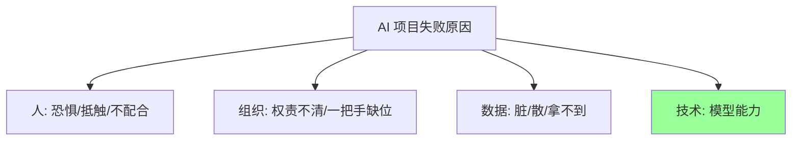

24 位 FDE 对落地难度的排序惊人一致：**人最难，其次是组织，再是数据，最后才是技术**。国企案例直言"以前总说万事俱备差个技术，现在技术反而是没有那么难的部分"[^1]；跨境快消案例估计"技术大概只占 20%"[^2]。

## 障碍一：员工的恐惧与抵触

员工听说 AI 的第一反应往往是"是不是要替代我"。如果这种情绪不解决，"你拿到的需求可能都是假的，产品上线以后也没人愿意真正使用"[^3]。具体表现：

- 业务人员不愿把自己的知识变成组织资产——"你让我把知识全部交出来，然后 AI 把我的工作替代掉，那我为什么要配合？"[^1]
- 城市规划案例中部门拖延提供数据和规则，甚至回一句"这些网上都有，你们自己查"[^4]
- 非标报价案例中员工担心被优化，对乙方 FDE 天然抵触[^5]

应对方式高度一致：把 AI 定位从"替代"切换到"助手"，保留人的确认权和责任，并配套人事激励与 KPI 调整——让省下来的时间转向更高价值的事，而不是裁人[^1][^6]。

## 障碍二：组织与规则

央国企财务案例的判断："一个项目如果单纯从技术上已经能够落地，其实已经成功了 80%。真正容易让项目死掉的，是业务、人和组织"[^7]。典型问题：

- **一把手工程**：AI 改变流程必然影响岗位职责和部门协作，乙方 FDE 无权安排甲方员工，老板必须自上而下推动[^5]
- **牵头部门**：国企案例第一年 IT 牵头做出技术底座但员工不用，第二年改由人事部门牵头从培训推进——AI 落地"一方面是技术项目，另一方面是组织转型项目"[^1]
- **利益与决策权**：车管所案例中自动审核暴露出过去人工审核的"放宽"，尺度决策必须交还业务负责人，FDE 只呈现数据和选项[^8]
- **认知对齐**：老板、中层、一线关注完全不同的东西，前期没把目标、边界、责任讲清，最后"做得不好就是 FDE 的问题"[^9]

## 障碍三：数据远比想象脏

- 上市公司销售数据照样散落在 Excel 和个人手里——"业务领先和数字化领先是两回事"[^10]
- 中小制造企业历史报价、物料、供应商信息很少能天然给 AI 用，数据清洗和"还原企业真实业务逻辑"本身就是项目的一部分[^11]
- 跨境场景的数据权限、隐私、出境合规，光数据申请就花了接近一个月[^12]
- ERP 数据陷入恶性循环：找不到物料 → 重复录入 → 数据更脏 → 更难找[^13]

## 障碍四：技术幻觉与过度设计

- **Demo ≠ 生产**：客户自建的 Agent "能跑起来"，但同一问题问两遍答案不一致；稳定性、成本、规模化才是生产门槛[^14]
- **高估 AI 能力**：电商比价案例低估了平台风控博弈的行业门槛，交付周期被拉长[^15]
- **盲目追新**：客户想要"多智能体博弈"，实际选址问题靠规则和指标计算更收敛；硬编码能解决的就不要上 Agent[^16]
- **为 AI 而 AI**：金融机构花大钱本地部署生图系统，结果图不能用，业务回去找设计师——"IT 完成了 AI 转型，业务什么都没改变"[^17]

## 障碍五：基础设施与环境

外贸小企业案例的 FDE 第一天几乎在当网络工程师：4 台路由器、2 台光猫、1 台交换机串成的混乱内网不解决，再好的 Agent 也跑不起来[^18]。央国企财务数据敏感，需要私有化部署和算力一体机，但两百万投入必须先有小场景证明价值才能推动——顺序不能反[^7]。

## 相关页面

- [FDE 方法论](/wiki/concepts/fde-methodology.md) — 小切口、陪跑等步骤正是为拆除这些障碍
- [人机分工模式](/wiki/concepts/human-ai-division.md) — 保留人的责任是化解抵触的核心手段
- [FDE 角色](/wiki/concepts/fde-role.md) — FDE 的大部分工作是拆障碍而非写代码

[^1]: Datawhale FDE案例100.pdf, p.142-143
[^2]: Datawhale FDE案例100.pdf, p.241
[^3]: Datawhale FDE案例100.pdf, p.126
[^4]: Datawhale FDE案例100.pdf, p.42
[^5]: Datawhale FDE案例100.pdf, p.175-176
[^6]: Datawhale FDE案例100.pdf, p.174, p.183
[^7]: Datawhale FDE案例100.pdf, p.92-93
[^8]: Datawhale FDE案例100.pdf, p.21-22
[^9]: Datawhale FDE案例100.pdf, p.103
[^10]: Datawhale FDE案例100.pdf, p.183
[^11]: Datawhale FDE案例100.pdf, p.175-176
[^12]: Datawhale FDE案例100.pdf, p.53
[^13]: Datawhale FDE案例100.pdf, p.79
[^14]: Datawhale FDE案例100.pdf, p.160, p.163
[^15]: Datawhale FDE案例100.pdf, p.102
[^16]: Datawhale FDE案例100.pdf, p.43-44
[^17]: Datawhale FDE案例100.pdf, p.205
[^18]: Datawhale FDE案例100.pdf, p.110-111