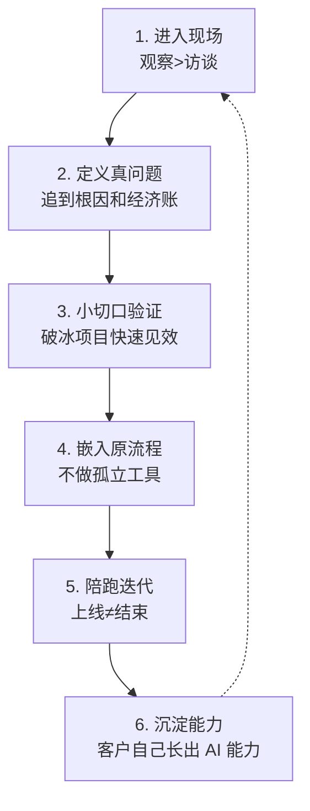

尽管 24 个案例横跨制造、政务、法律、物流、电商等完全不同行业，FDE 们的工作路径却惊人地一致。这套方法不是从理论推导出来的，而是从真实项目里反复踩坑后收敛出的共性。

## 第一步：进入现场，观察胜过访谈

几乎每个案例都强调：真实需求在会议室里问不出来。制造培训案例中，FDE 发现一线员工不愿花时间接受访谈、也描述不清自己的工作细节，于是改为直接跟着员工走一遍每天的工作流程——看他一天在做什么、在哪里停下来、哪里需要问别人[^1]。ERP 案例中，团队花数月访谈 15 个团队，甚至直接坐在业务人员旁边看他操作，才把"ERP 不好用"这句抱怨拆解成具体功能点[^2]。城市规划案例要求 FDE "先把自己逼成半个规划师"，术语答不上来就无法建立信任[^3]。

## 第二步：定义真问题，追到根因和经济账

客户说出的需求往往不是真问题。ERP 案例把"ERP 不好用"一路追到底：**搜索困难 → 重复录入 → 数据污染 → 错误/重复采购 → 库存积压 → 报废 → 真实财务损失**。只有这条链路成立，才知道这个 AI 应用值多少钱[^4]。工程租赁案例中，表面需求是"智能报价"，真问题是"老板没办法服务长尾客户"[^5]。多个案例强调 ROI 定义要放在项目开始：问题解决了企业一年减少多少损失、数字怎么算、谁来确认，都要事先讲清[^6]。

## 第三步：小切口验证（"破冰项目"）

央国企财务案例提出"摘离自己最近、最甜的桃子"：第一个项目要选业务真的痛、实现可控、ROI 能快速看见的场景，让业务部门拿到结果、成为标杆，后面的资源和预算才容易获得[^7]。城市规划案例从整个市收敛到一个区、再到一个具体单元、只挑两条业务流——"场景足够小，数据才有可能搞干净；数据搞干净，结果才精准；结果精准，业务人员才愿意相信"[^8]。车管所案例甚至以遗留系统运维作为进入现场的入口[^9]。

## 第四步：嵌入原有流程，不做孤立工具

这是区分"AI 演示"和"AI 落地"的关键一步：

- 制造培训：AI 知识能力接进企业原有培训平台，设计成课程打卡流程，没有额外增加一个聊天机器人[^10]
- 车管所：识别、审核、填单、系统流转全部串联，RPA 联动原有 Web 系统，工作人员只看结果和报表[^11]
- 城市规划：不把所有功能塞进输入框，保留规划师熟悉的"左边筛选、中间地图、右边 Copilot"布局[^12]
- 律师案例：把入口从对话框改为案件工作台，先建案再交互，律师不必每次重新描述背景[^13]

## 第五步：陪跑迭代，上线不等于结束

制造培训案例仅陪跑就接近两个月，整个项目约半年——"企业 AI 落地很少是系统上线=项目结束，真正的落地往往发生在上线之后"[^14]。非标报价案例的推广路径是：关键人试用 → 业务小组试点 → 真实订单验证 1-2 个月 → 反馈调整 → 部门推广[^15]。电信案例强调"能跑"和"生产就绪"是两回事：同一个问题反复问答案是否一致、成本能否承受、几十上百用户如何统一管理[^16]。

## 第六步：沉淀能力，让客户越来越独立

好的 FDE 项目的标志，是交付结束后客户自己开始长出 AI 能力：城市规划案例中部门开始自己把流程沉淀成 Skill[^17]；国企案例中行政人员自己用提示词做出了补货提醒 Agent——"FDE 交付的多了一层意义：它在企业内部培养出了新的 AI 使用者"[^18]。生物科技案例协助企业搭起 20 人内部 AI 团队[^19]。外贸案例则展示了 FDE 自身的沉淀：把方法论复用到下一个客户，第一次 100% 成本，第二次 80%，第三次 60%[^20]。

## 相关页面

- [FDE 角色](/wiki/concepts/fde-role.md) — 这套方法论的执行者是谁
- [人机分工模式](/wiki/concepts/human-ai-division.md) — 方法论中"嵌流程"的核心设计
- [AI 落地障碍](/wiki/concepts/ai-implementation-barriers.md) — 每一步会遇到的典型阻力

[^1]: Datawhale FDE案例100.pdf, p.9-10
[^2]: Datawhale FDE案例100.pdf, p.78
[^3]: Datawhale FDE案例100.pdf, p.38-39
[^4]: Datawhale FDE案例100.pdf, p.79, p.81
[^5]: Datawhale FDE案例100.pdf, p.227-228
[^6]: Datawhale FDE案例100.pdf, p.85
[^7]: Datawhale FDE案例100.pdf, p.91, p.93-94
[^8]: Datawhale FDE案例100.pdf, p.38-39
[^9]: Datawhale FDE案例100.pdf, p.16
[^10]: Datawhale FDE案例100.pdf, p.10-11
[^11]: Datawhale FDE案例100.pdf, p.19
[^12]: Datawhale FDE案例100.pdf, p.40
[^13]: Datawhale FDE案例100.pdf, p.29
[^14]: Datawhale FDE案例100.pdf, p.11
[^15]: Datawhale FDE案例100.pdf, p.173
[^16]: Datawhale FDE案例100.pdf, p.160, p.163
[^17]: Datawhale FDE案例100.pdf, p.41-42
[^18]: Datawhale FDE案例100.pdf, p.141-142
[^19]: Datawhale FDE案例100.pdf, p.181-182
[^20]: Datawhale FDE案例100.pdf, p.55