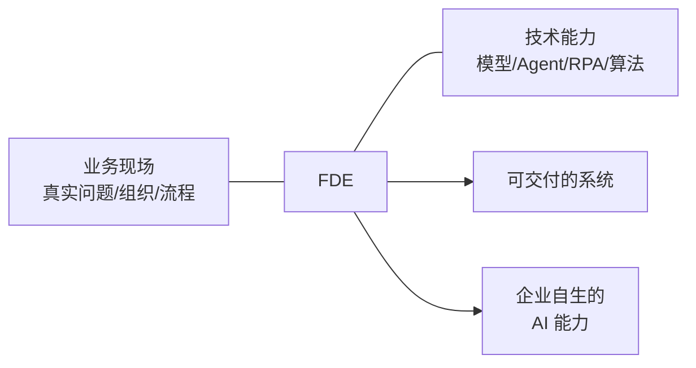

FDE（Forward Deployed Engineer，前瞻部署工程师）是 Datawhale 案例集中 24 位受访者共同扮演的角色：不是交付一个系统就离开的外包方，而是与企业一起发现问题、定义问题、构建方案、验证价值的**长期共建伙伴**。一次项目的结束不应意味着 AI 能力的离开——真正有价值的落地，是企业在解决一个具体问题的同时，开始学会如何解决下一个问题[^1]。

## 角色定位：桥梁而非工匠

24 个案例对 FDE 的描述高度一致，可以归纳为三层：

- **翻译官**：把技术语言翻译成业务语言，把业务问题翻译成可落地的技术方案。老板不关心 Agent、RAG，只关心"你能不能帮我把这个问题解决掉"[^2]
- **顾问先于工程师**：FDE 进入企业，首先应该像顾问——先问"企业经营中最重要的十个问题是什么"，再判断哪些问题适合数字化、智能化，哪些即使 AI 能做也不值得投入[^3]
- **组织者**：项目落地后会涉及不同部门、角色和外部伙伴，FDE 必须会沟通、协调、项目管理，甚至"算利益账"——让不同角色看到变化对他意味着什么[^4]

## 与传统外包的区别

| 维度 | 传统软件外包 | FDE |
|---|---|---|
| 目标 | 需求→系统→验收→交付 | 进入业务→理解问题→迭代→对业务结果持续负责 |
| 需求来源 | 客户给需求文档 | 客户常不知道自己要什么，FDE 驻场观察发现真问题[^5] |
| 成功标准 | 功能按时交付 | 业务结果改变，且客户能说出"这笔钱确实被省下来了"[^6] |
| 项目结束 | 人撤走 | 方法、经验、能力沉淀在组织内部，客户开始自己长出 AI 能力[^7] |

## 角色的动态演化

FDE 在一个项目中的角色不是固定的。城市规划案例的 FDE 总结了自己经历的三个阶段：先进去学习行业，做"半个规划师"；理解业务后帮助重新定义问题、设计流程；当客户自己会做 Skill、会搭 AI 应用后，退到更高位置做架构和方向顾问[^8]。制造培训案例则给出能力放大路径：从一个人什么都做的"中间态"，到聚焦行业，再到把交付经验沉淀为团队 SOP，最后提炼为标准产品——从个人能力到团队能力再到可复制的产品能力[^9]。

## 为什么这个角色现在出现

案例集的判断是：AI 应用的技术门槛正在快速降低，但企业自身的流程、组织和真实业务环境不会因此自动变清晰。FDE 真正要解决的是 AI 与企业之间"最后一公里"的问题——技术会变、模型会变，但"深入现场、发现问题、验证方案、进入流程"的能力会长期存在[^10]。甚至有 FDE 预言：当 AI 能力像互联网一样成为每个人的基础能力后，FDE 这个职位可能消失，但"既懂业务又懂 AI、能发现问题并落到流程"的能力会留下来[^11]。

## 相关页面

- [FDE 方法论](/wiki/concepts/fde-methodology.md) — 24 个案例沉淀出的共性工作方法
- [人机分工模式](/wiki/concepts/human-ai-division.md) — FDE 如何划分 AI 与人的边界
- [AI 落地障碍](/wiki/concepts/ai-implementation-barriers.md) — FDE 要拆除的非技术障碍
- [FDE案例100 案例集](/wiki/entities/datawhale-fde-casebook.md) — 24 个案例全索引

[^1]: Datawhale FDE案例100.pdf, p.2-3
[^2]: Datawhale FDE案例100.pdf, p.54-55
[^3]: Datawhale FDE案例100.pdf, p.23
[^4]: Datawhale FDE案例100.pdf, p.22-23
[^5]: Datawhale FDE案例100.pdf, p.17
[^6]: Datawhale FDE案例100.pdf, p.82-83
[^7]: Datawhale FDE案例100.pdf, p.41-42
[^8]: Datawhale FDE案例100.pdf, p.45-46
[^9]: Datawhale FDE案例100.pdf, p.95
[^10]: Datawhale FDE案例100.pdf, p.14
[^11]: Datawhale FDE案例100.pdf, p.196