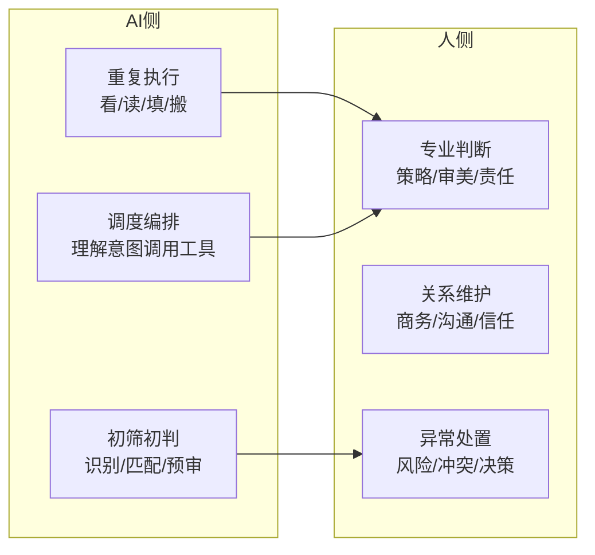

24 个案例没有任何一个追求"全自动无人化"。相反，如何划分 AI 与人的工作边界，是每个项目最核心的设计决策。共性原则可以概括为：**AI 接手高频、重复、规则明确的工作；信任、关系和最终责任留给人**。

## 通用分工框架

| 案例 | AI 承担 | 人保留 |
|---|---|---|
| 法律 | 材料整理、关系梳理、初步分析 | 策略选择、最终专业责任[^1] |
| TikTok 达人 | 达人筛选、商品匹配、履约提醒、脚本建议 | 与重要达人的商务沟通[^2] |
| 央国企财务 | 发票识别、规则判断、RPA 执行 | 监督、风险与异常处理[^3] |
| 消防图纸 | 规范匹配的初稿生成 | 参数调整、最终图纸责任[^4] |
| 包装审核 | 错别字、法规、NRV 计算的确定性检查 | 审美与产品表达判断[^5] |
| 跨境装车 | 三维装载计算、指导图生成 | 现场执行与安全判断[^6] |

## 为什么关键节点必须留人

- **错误的代价不对称**：TikTok 案例中，AI 对几百万粉丝达人说错一句话，损失远超自动化节省的人力，所以最终没做"全自动建联"[^2]
- **责任无法外包**：消防设计人员对图纸合规性和安全性负责，不能接受"大概对"或黑箱结果；财务、法务等严肃业务同理[^4][^3]
- **判断依赖上下文**：包装是否表达清楚产品、文案"味道对不对"，这类判断需要业务上下文和审美，AI 只能提供支持[^5][^7]

## 技术架构上的分工：模型不包办一切

多个案例采用了"大模型负责理解与调度，专业算法/系统负责确定性计算"的架构：

- 跨境装车：大模型理解需求、调用算法、解释结果；三维空间计算交给 Python 算法（高度图、贪心、遗传算法）[^6]
- 城市规划：模型负责理解和分析，GIS 专业工具负责事实和计算，"AI 更像一个调度者"；高频规则明确的任务固化成工作流，长尾开放问题才交给 Agent[^8]
- 包装审核：NRV 营养计算固化成确定性代码，模型只做解释和补录建议，实现可复现验证[^5]
- 央国企财务：多个 AI 角色分工——一个执行判断、一个监督、一个发现风险[^3]

电商库存案例给出选型原则：规则死的任务写脚本跑定时任务就够，只有涉及语义理解、跨系统判断时才引入 Agent——"先问这个问题到底需不需要 AI"[^9]。

## 回退机制与校准飞轮

内容生产案例的做法是"先假设 AI 能做，再通过实测把做不好的节点逐渐交还给人"[^7]。非标报价案例设计了人工校准兜底：业务人员只审模型把握不大的字段，修正结果回填到数据和模型——**AI 生成 → 人工校准 → 数据回填 → 下一次更准**，人工要审的部分越来越少[^10]。这本质上与 RAG 时代的"人在环路"（Human in the loop）一致，但被工程化成了数据飞轮。

## 人的时间去哪了：从执行者到决策者

所有案例的效果都不只是"省人工"，而是人的角色上移：律师从执行者变成决策者[^1]；设计人员从 70% 执行 + 30% 判断，变成专注审核与质量控制[^4]；车管所工作人员从看图片转向群众咨询[^11]。对账案例总结得最直白："AI 落地在做的是重新组织人的工作方式，而不是普通自动化"[^12]。多个案例明确反对把 AI 与裁员绑定——释放出来的人应转向更高价值的业务，否则项目会变成企业与员工的对抗[^13]。

## 相关页面

- [FDE 方法论](/wiki/concepts/fde-methodology.md) — 分工是"嵌入流程"步骤的核心
- [FDE 角色](/wiki/concepts/fde-role.md) — FDE 负责划定这条边界
- [AI 落地障碍](/wiki/concepts/ai-implementation-barriers.md) — 员工抵触多源于边界没划好

[^1]: Datawhale FDE案例100.pdf, p.28, p.30-31
[^2]: Datawhale FDE案例100.pdf, p.50, p.53
[^3]: Datawhale FDE案例100.pdf, p.90
[^4]: Datawhale FDE案例100.pdf, p.211, p.213
[^5]: Datawhale FDE案例100.pdf, p.191
[^6]: Datawhale FDE案例100.pdf, p.61
[^7]: Datawhale FDE案例100.pdf, p.149, p.151
[^8]: Datawhale FDE案例100.pdf, p.39-40
[^9]: Datawhale FDE案例100.pdf, p.223
[^10]: Datawhale FDE案例100.pdf, p.173, p.175
[^11]: Datawhale FDE案例100.pdf, p.21
[^12]: Datawhale FDE案例100.pdf, p.51
[^13]: Datawhale FDE案例100.pdf, p.104-105