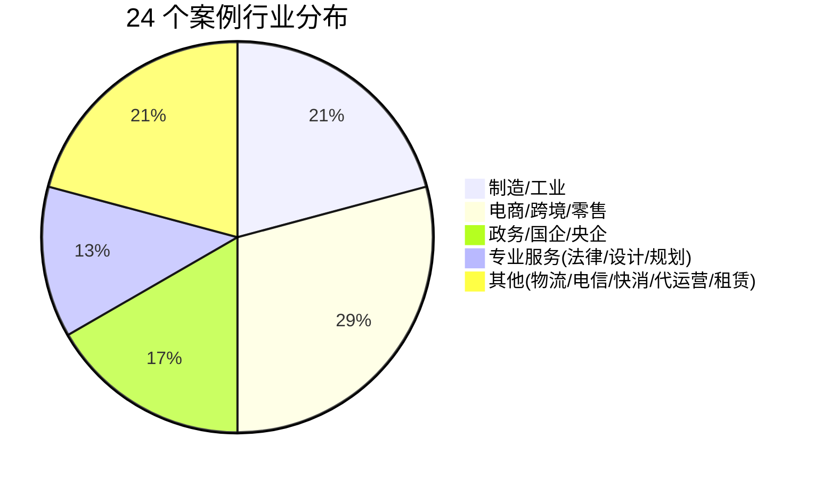

《FDE案例100》是 Datawhale 于 2026 年 9 月发布的企业 AI 落地案例集（本 workspace 收录的 246 页 PDF 收录前 24 个案例）。案例集的定位不是"100 个 AI 落地标准答案"，而是记录先行者如何发现问题、理解业务、选择技术、在现实条件下做取舍的真实探索过程[^1]。案例按 FDE 姓名首字母排序，每个案例以固定六问（Q1 场景与问题、Q2 过去怎么解决、Q3 思路与步骤、Q4 实际效果、Q5 挑战、Q6 经验）展开[^2]。

## 24 个案例全索引

| # | 案例 | 行业 | 核心技术 | 关键效果 | 起始页 |
|---|---|---|---|---|---|
| 1 | 师徒带教→AI 辅助培训 | 制造业 | RAG 知识库 | 经验沉淀为可追踪的组织流程 | p.8 |
| 2 | 车管所自动化办件 | 政务 | OCR/RPA/视觉 | 单件 15→3-5 分钟，日办件 800→1100 | p.16 |
| 3 | 诉讼律师智能协作 | 法律 | 案件工作台+知识图谱 | 100 万字材料 1 天梳理完，效率+70% | p.26 |
| 4 | 城市规划智能研判 | 政务/规划 | Agent 调度 GIS 工具 | 跨部门报告 3-5 天→10-20 分钟 | p.35 |
| 5 | TikTok 达人建联履约 | 跨境电商 | 匹配算法+工作流 | 履约周期 30→18 天 | p.48 |
| 6 | 跨境物流装载优化 | 物流 | 大模型调度+3D 装箱算法 | 稳定越过 98 方保本线，装车 5h→2h | p.57 |
| 7 | 企业研发 AI 转型 | 金融 | Spec Coding 方法 | 代码时间省 1/3，文档省一半 | p.69 |
| 8 | 工业采购物料检索 | 工业 | 语义检索+数据清洗 | 从源头减少错误/重复采购 | p.78 |
| 9 | 央国企财务流程 | 央企 | AI 判断+RPA+监督机制 | 半月流程→1-2 天，落地 10 个场景 | p.88 |
| 10 | 线下零售智能对账 | 零售 | OCR+自动化工作流 | 人天→小时，找回被容忍区间放弃的收入 | p.97 |
| 11 | 外贸企业资料资产化 | 外贸 | 本地 Codex+Harness | 数据不出企业，远程协同开发 | p.107 |
| 12 | 鞋服电商素材工作流 | 电商 | AI 生图+一致性验收 | 个人产出→公司级素材资产（POC 中） | p.120 |
| 13 | 消防维保数字化 | 传统服务 | 轻量流程数字化+AI 辅助 | 纸质→数据驱动，叫停 10 万无效采购 | p.130 |
| 14 | 国企工作流落地 | 国企 | 知识萃取+培训+Agent | 法务编制节省，员工自建 Agent | p.137 |
| 15 | 本地生活内容生产 | 代运营 | 工作流+回退机制 | 日更 200-300 条文案的稳定量产 | p.147 |
| 16 | 电信网络数据分析 | 电信 | 生产级 Agent 系统 | 分析从天级→分钟/小时级 | p.159 |
| 17 | 非标制造售前报价 | 制造 | 多模态图纸解析+垂类 Agent | 报价工作量减少 50%+ | p.167 |
| 18 | 生物科技数智化 | 生物科技 | CRM+数仓+AI/BI | 新人培训 2 月→3 周 | p.179 |
| 19 | 消费品研发与包装审核 | 消费品 | 岗位说明书法+OCR/VLM | 审核前置，经验变组织资产 | p.187 |
| 20 | 制造企业经营透明化 | 汽车供应链 | 数据关系处理+异常提醒 | ERP 数据→经营视角 | p.198 |
| 21 | 建筑消防图纸生成 | 建筑设计 | 自研 CAD 解析+规则引擎 | 数天绘图→30 分钟初稿 | p.208 |
| 22 | 跨境电商库存联动 | 跨境电商 | 数据打通+Agent | 看图 4-5h→1h 内，库存联动广告 | p.217 |
| 23 | 工程租赁获客报价 | 工程租赁 | 混合方案（规则+模型） | 接住老板无暇服务的长尾客户 | p.227 |
| 24 | 跨境快消数据断层 | 快消 | 非结构化抽取+异常标记 | 费用问题发现率 10%→30% | p.235 |

## 行业分布与场景类型

按场景类型可归为五类：

- **知识沉淀与传承**：案例 1、14、18（隐性经验→组织知识资产）
- **流程自动化**：案例 2、9、10、15（看/读/填/搬交给机器）
- **专业工作增强**：案例 3、4、17、21（AI 初稿+专家判断）
- **数据打通与经营透明**：案例 8、13、20、22、24（割裂数据→业务链路）
- **新业务承接**：案例 5、6、23（过去因成本放弃的事重新可行）

## 贯穿全书的判断

编者在序言中定调：AI 落地已经不只是技术问题，问题会从"模型能不能做到"延伸到"什么问题值得解决""数据和知识如何组织""新的工作流程如何建立""项目上线后由谁持续运营"，最终进入组织本身[^3]。这与 24 位受访者的实战经验互为印证——详见 [AI 落地的真实障碍](/wiki/concepts/ai-implementation-barriers.md)。

## 相关页面

- [FDE 角色](/wiki/concepts/fde-role.md) — 案例集主角的角色定义
- [FDE 方法论](/wiki/concepts/fde-methodology.md) — 24 案沉淀的共性路径
- [人机分工模式](/wiki/concepts/human-ai-division.md) — 各案例的边界设计
- [Datawhale](/wiki/entities/datawhale.md) — 出品方

[^1]: Datawhale FDE案例100.pdf, p.2
[^2]: Datawhale FDE案例100.pdf, p.5-6
[^3]: Datawhale FDE案例100.pdf, p.2-3